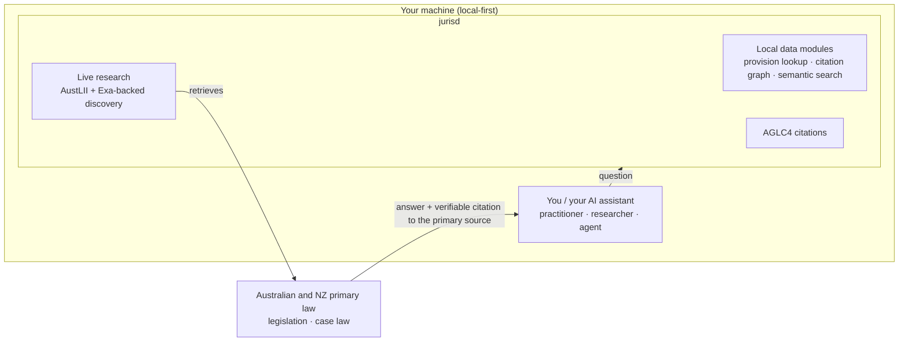

# jurisd

**Source-grounded Australian & New Zealand legal research, on your own machine.**

jurisd is an open, local-first research and drafting workbench for AU/NZ law. It
gives you, or the AI assistant you already use, fast answers from legislation and
case law where **every claim traces back to the primary source**. It runs locally
by default, so confidential and privileged work never has to leave your machine.



Guiding principle: **no source span, no trusted legal claim.** Vector recall is
recall, not authority; a model's output is a candidate until you can see its
source and check it.

> _Previously published as `auslaw-mcp`._

**Status:** v0.5.0, pre-1.0. The surface that ships today is a CLI, a TUI search
shell, and a set of tools the AI assistant you already run can call, across live
research, citation and bibliography work, and local data modules. The longer arc
is in [Where this is heading](#where-this-is-heading).

## Why jurisd is different

- **Traceable, not hallucinated.** Every result links to its primary source (an
  `austlii.edu.au` URL, the provision text, an AGLC4 citation). You verify it; you
  do not take its word.
- **Local-first and private.** Recall, provision lookup, and the citation graph
  work offline over installed corpora. Your matter stays on your machine.
- **Australian-law-native.** All AU/NZ jurisdictions, jurisdiction-aware search,
  AGLC4 citation formatting.
- **Degrades visibly, never silently.** A missing key, dependency, or module
  disables only the feature that needs it and says so. With no key and no network,
  local-module recall still answers.

## Who it's for

- The **practitioner** who just wants to ask a question and get an answer they can
  stand behind in front of a client or a court.
- The **researcher or student** who needs to trace authority, not just read a
  summary.
- The **terminal-native power user** who wants scriptable, composable legal tools.
- The **builder** wiring AU/NZ legal research into their own AI agent.

## How jurisd answers

jurisd has three answer sources, tried in precedence order:

1. **Local data modules** (offline, no network, no key). Installed parquet bundles
   holding legislation and decisions with provision-level structure, citation
   edges, and chunk embeddings. This is the local-first core: deterministic
   provision lookup, an Act containment tree, an offline citation graph, and local
   semantic search.
2. **Live research over AustLII.** Natural-language case and legislation search,
   full-text fetch (HTML and PDF), and AGLC4 formatting. AustLII's own search sits
   behind a Cloudflare challenge, so discovery is recovered through Exa-backed
   search (and direct citation URLs); the documents returned are AustLII primary
   sources throughout. See [Tools](#tools) for the detail.
3. **OALC fallback.** An Open Australian Legal Corpus layer that backs the live
   layer when a direct fetch is blocked.

## Quick start

### Run with npx (no clone)

```bash
npx -y jurisd
```

`npx` installs the package from its built distribution and launches the server
over stdio in one step. Before the npm registry package is published, use
`npx -y github:russellbrenner/jurisd`.

### Install the CLI persistently from NPM or directly from GitHub

#### npm published package

```bash
npm install -g jurisd
jurisd --help
```

#### npm install via git directly, including your own fork

```bash
npm install -g https://github.com/russellbrenner/jurisd/archive/refs/heads/main.tar.gz
jurisd --help
```

**NB:** Bare git installs such as `npm install -g github:russellbrenner/jurisd` depend
on npm's `install-links` setting and can leave a broken global bin on hosts where
`install-links=false`.

### Register with Your Coding Agent

```bash
claude mcp add jurisd -- npx -y github:russellbrenner/jurisd
```

Or add it to your client config directly:

```json
{
  "mcpServers": {
    "jurisd": {
      "command": "npx",
      "args": ["-y", "github:russellbrenner/jurisd"]
    }
  }
}
```

Using a different agent? [docs/HARNESS-SETUP.md](docs/HARNESS-SETUP.md) has
copy-paste configs for Cursor, Windsurf, VS Code, Cline, Continue, Codex CLI,
Zed, Gemini CLI, and more.

All environment variables are **optional** — with none set, the live AustLII
layer and the local-module recall layer both work. See
[docs/INSTALL.md](docs/INSTALL.md) for the local-clone path, every config option,
and the offline/baseline guarantee.

### Claude Code skill

A bundled [Claude Code skill](skills/jurisd-research/SKILL.md) teaches the agent
expert jurisd usage from day 0 — which of the 12 tools to reach for, the
local-first/live-fallback rule, AGLC4 citation workflows, and a
[worked research session](skills/jurisd-research/examples/research-session.md).
Install it by copying the skill folder into your skills directory:

```bash
cp -r skills/jurisd-research ~/.claude/skills/
```

(or your plugin's skills path). The skill activates automatically on legal-research
and AGLC4 prompts once the `jurisd` MCP server is registered.

## Tools

12 tools in three groups. Operation variants are selected via a
`mode` / `op` / `action` / `by` discriminator on the relevant tool.

### Live research (AustLII)

| Tool                  | What it does                                                                                                                  |
| --------------------- | ----------------------------------------------------------------------------------------------------------------------------- |
| `search_cases`        | Natural-language case-law search across all AU/NZ jurisdictions; authority ranking; title/phrase/boolean methods; pagination. |
| `search_legislation`  | Search AU/NZ legislation with the same method/jurisdiction/sort controls.                                                     |
| `fetch_document_text` | Fetch full text from an AustLII URL (HTML, PDF).                                                                              |

> **AustLII sits behind Cloudflare.** AustLII now serves a JavaScript
> managed-challenge that automated clients — including TLS-impersonating ones —
> cannot clear, so `search_cases` / `search_legislation` cannot query AustLII
> directly. Configure a **fallback source**; results are still AustLII primary
> sources (`austlii.edu.au` URLs) recovered through another channel.
>
> | Fallback            | Env var       | Cost           | You gain                                                                                                         | You lose                                                                                                                                    |
> | ------------------- | ------------- | -------------- | ---------------------------------------------------------------------------------------------------------------- | ------------------------------------------------------------------------------------------------------------------------------------------- |
> | **Direct citation** | none          | Free           | Queries containing a neutral citation such as `[2018] HCA 9` resolve directly to the canonical AustLII case URL. | Citation-only. It is not general natural-language search.                                                                                   |
> | **Exa**             | `EXA_API_KEY` | Paid/free tier | Search discovery returns canonical AustLII case/legislation URLs, even for obscure cases.                        | Discovery only (URL + citation); full text is fetched separately.                                                                           |
> | **none**            | -             | -              | -                                                                                                                | Search returns a degraded result whose warning names the env vars; document fetch still falls back to the local OALC corpus when available. |
>
> Resolution order: direct citation URL when present, then Exa, then a degraded
> result. The document source remains AustLII throughout.

When AustLII search is Cloudflare-blocked, the tools degrade gracefully rather
than failing: `search_cases` returns any Exa results it can find
plus a `warning`, `sources`, and `degraded: true`, and reports incomplete
configured coverage (for example `exa: "not_configured"`) instead of hiding
that source status. `search_legislation` returns an empty degraded result with
the same machine-readable status instead of failing the tool call. CLI search
commands exit 4 for degraded source coverage.

### Citation + bibliography (AGLC4)

| Tool               | What it does                                                                                                         |
| ------------------ | -------------------------------------------------------------------------------------------------------------------- |
| `format_citation`  | Format an AGLC4 citation. `mode`: `full` (default), `short`, `ibid`, `subsequent`, `pinpoint`.                       |
| `resolve_citation` | Resolve a citation to its source. `mode`: `auto` (default), `validate` (AustLII existence check), `search`.          |
| `cite`             | Write to the local citation cache. `action`: `add` (default) or `refresh_source` (conditional-HEAD freshness check). |
| `bibliography`     | Read the local citation cache (no network). `op`: `get`, `list` (default), `export` (`.bib`), `cited_by`.            |

### Local data modules (offline recall)

These five tools serve installed offline data modules. They require the optional
`@duckdb/node-api` dependency and at least one installed module;
`semantic_search_local` additionally needs `@huggingface/transformers`. Every
answer carries `metadata.source = "local_module"` with the module name, version,
and snapshot date (plus a staleness advisory when the snapshot is old).

| Tool                    | What it does                                                                                                                                           |
| ----------------------- | ------------------------------------------------------------------------------------------------------------------------------------------------------ |
| `get_provision`         | Deterministic provision lookup (e.g. `s 18` of an Act). No embedding, no ranking; typed not-found so the router can fall through.                      |
| `get_act_structure`     | Containment tree of an Act (Act → Part → Division → section/schedule/clause) over `act_provision` edges, closed-world.                                 |
| `find_citing`           | Documents in installed modules that cite a target, with each citation's provenance span.                                                               |
| `semantic_search_local` | Vector recall: the query is embedded locally (bge-small, offline, no key) and ranked by cosine over chunk embeddings, with optional facet pre-filters. |
| `list_data_modules`     | Introspect installed modules: coverage, doc/chunk counts, embedding descriptor, load status, snapshot date and staleness.                              |

Full parameter tables for every tool are in
[docs/AGENT-GUIDE.md](docs/AGENT-GUIDE.md).

## CLI foundation and compatibility

jurisd keeps the MCP server as the compatibility surface while the CLI is being
reorganised around task-oriented command contracts.

- CLI guide: [docs/CLI.md](docs/CLI.md)
- MCP compatibility reference: [docs/MCP-COMPATIBILITY.md](docs/MCP-COMPATIBILITY.md)
- Security and authority model: [docs/SECURITY-AUTHORITY.md](docs/SECURITY-AUTHORITY.md)

Existing flat CLI commands remain available during the foundation work.

## Data modules

A **data module** is a self-describing parquet bundle (documents, chunks, edges,
unmatched citations, plus a `manifest.json`) published as a Hugging Face dataset.
Everything needed to load and query a module — schema version, coverage,
embedding descriptor, file hashes, and licence posture — is in its manifest. No
out-of-band config.

> **Status: first module published.** `legislation-cth` is available from
> `workingmem/legislation-cth` on Hugging Face. It provides Commonwealth primary
> and secondary legislation, 32,143 documents, 857,262 chunks, citation edges,
> unmatched citations, and local bge-small embeddings. Running
> `jurisd fetch-module legislation-cth` downloads the manifest and parquet files
> from Hugging Face, verifies every file against the manifest sha256 values, and
> installs the module atomically.

Modules are queried in place: DuckDB scans the parquet on disk and never
materialises a whole table into memory, so a host can install many modules
(Commonwealth legislation + per-state + decisions) and stay flat in RSS.

### Installing modules

Modules are **operator-installed via the CLI** (kept off the tool surface so an
LLM never triggers a large download mid-conversation):

```bash
jurisd fetch-module <name> [--modules-dir DIR]   # download + sha256-verify + atomic install
jurisd verify-module <name> [--modules-dir DIR]  # re-verify installed files against the manifest
jurisd list-modules [--modules-dir DIR]          # list installed modules (incl. refused)
```

The default install root is `~/.jurisd/modules/` (override with
`JURISD_MODULES_DIR` or `--modules-dir`). `fetch-module` validates the manifest
and checks the schema version **before** downloading any parquet, sha256-verifies
every file against the manifest, installs atomically (temp-then-rename, so a
half-written module never appears), and prints the licence attribution lines at
install time.

Advanced operators can pass `--manifest-url URL` to install from an explicitly
trusted manifest. The sha256 checks prove downloaded files match that manifest;
they do not prove the manifest's provenance or protect against a malicious or
compromised manifest source.

### Baseline vs domain-specialised variants

A module's identity is `(name, module_version)`. The `module_version` handle
distinguishes a module's **variant** — a **baseline** module is the standard
build (deterministic structure, citation edges, bge-small embeddings); a
**domain-specialised** variant is a build tuned for a particular corpus or task.
Use `list_data_modules` to see the variant, coverage, and embedding descriptor of
each installed module, and pin a specific one with the `module` argument on any
recall tool.

### BYOK provider adapter

`semantic_search_local` has two optional enhancement slots that operate **over
the locally-retrieved top-k results** — they never replace local recall, they
refine it:

- **rerank** — reorder the local top-k by a stronger relevance model.
- **extractive-QA** — return the best answer span within a retrieved chunk.

Both are expressed through one vendor-neutral `DomainAdapter` interface. The
distinction is **capability presence**, framed as **baseline vs
domain-specialised** with a **provider-interpolated display label**:

- **Baseline** (always present): pure local cosine order. No network, no key.
- **Domain-specialised** (slot): selected only if a provider is configured **and
  reachable** via a BYOK key. With `ISAACUS_API_KEY` set and the endpoint
  reachable, the capability probe reports
  `domain_adapter: { label: "Isaacus-enhanced", canRerank: true, canExtractiveQA: true }`
  and responses carry `metadata.enhancement = "Isaacus-enhanced"`.

If the key is unset, or set-but-unreachable, the adapter degrades to baseline and
the tool still returns local cosine results — reported by the probe, never thrown
into a tool result.

## Quality

jurisd's local data layer is built and scored honestly against a gold set. The
`jurisd-data` gold-set evaluation measures the local enricher (segments, defined
terms, citation crossrefs) against 90 Open Australian Legal Corpus / Kanon ILDGS
documents, under two parallel metrics:

- **strict** — the conservative audit metric: every typed prediction unmatched
  within its type is a false positive.
- **aligned** — the decision metric: a strict false positive whose span
  co-locates an _untyped_ gold sub-span at IoU ≥ 0.9 is credited as a granularity
  agreement (a vocabulary disagreement with the silver standard, not an extraction
  error) rather than penalised.

The current baseline **does not yet pass all four gate thresholds** (segment F1,
citation precision, citation recall, defined-term F1). Headline segment F1 is
0.44 strict / 0.64 aligned against a 0.85 gate. The report localises every gap
to a specific rule (the residual segment gap is genuine over-segmentation, chiefly
an endnotes-boundary flood; citation precision is internal-ref over-firing on
structural lines). The published module exposes the resulting data artefacts;
evaluation reports remain part of the module publishing workflow until a public
report location is available.

## Where this is heading

The sections above describe what ships today. The longer arc for jurisd is a
secure, local-first workbench for high-trust legal work, built so serious
reasoning can happen on your own machine with every act provable and nothing
leaving without your say-so. Planned directions (design intent, not yet built):

- **A sandboxed local agent runtime.** Run a research and drafting agent over your
  own sources inside an isolated, encrypted workspace, so sensitive and privileged
  material cannot leak.
- **Tamper-evident provenance.** An auditable record of every step, and an
  Evidence Pack you can hand a reviewer to verify process and sources (not legal
  correctness).
- **A first-class desktop app and TUI.** Matter view, source and provenance pane,
  review queue, and a drafting canvas, for both terminal-native researchers and
  practitioners who just want a clean interface.
- **An SDK and plugin base,** with connectors for the tools you already use (Word,
  Obsidian, Zotero).
- **Source-anchored drafting.** Work-product where every assertion carries its
  citation, gated by human review.

Nothing in this list is claimed as built. See [ROADMAP.md](docs/ROADMAP.md) for
the sequenced workstreams and review gates.

## Licensing

- **Code:** Apache-2.0 (see [LICENSE](LICENSE)). Third-party dependency licences are
  catalogued in [LICENSE-THIRD-PARTY.md](LICENSE-THIRD-PARTY.md).
- **Module data:** licensed **per source**, declared in each module's
  `manifest.json` `licence` block, and surfaced at `fetch-module` install time.
  The aggregate is CC-BY-4.0 (Open Australian Legal Corpus), but redistribution is
  decided per source, not in aggregate:
  - **AustLII-sourced rows are excluded from published modules by default** — the
    AustLII Terms of Service is restrictive, and re-importing it is exactly what
    the live transport layer routes around. They remain available **recipe-only**
    (rebuild locally).
  - **VIC** and **NT** legislation are **not redistributable** (Government Printer
    / Crown copyright, no open licence) — **recipe-only**.
  - Commonwealth (FRL), NSW, QLD, SA, TAS, WA legislation and HCA/FCA/NSW
    case-law sources are redistributable under the CC-BY-4.0 aggregate, subject to
    per-source confirmation before each module publishes.

Each published module carries its own `licence` block in `manifest.json`,
surfaced at `fetch-module` install time.

## Documentation

| Document                                                 | Description                                                                |
| -------------------------------------------------------- | -------------------------------------------------------------------------- |
| [INSTALL.md](docs/INSTALL.md)                            | Day-0 install paths, Claude Code config, env vars, module flow             |
| [HARNESS-SETUP.md](docs/HARNESS-SETUP.md)                | Copy-paste MCP config for every popular coding agent (CC, Cursor, Zed, …)  |
| [CLI.md](docs/CLI.md)                                    | CLI command shape, compatibility aliases, output rules, exit codes         |
| [MCP-COMPATIBILITY.md](docs/MCP-COMPATIBILITY.md)        | Compatibility reference for the current MCP tool surface                   |
| [SECURITY-AUTHORITY.md](docs/SECURITY-AUTHORITY.md)      | Command authority, side-effect classes, terminal safety, credential rules  |
| [jurisd-research skill](skills/jurisd-research/SKILL.md) | Claude Code skill: tool decision guidance, AGLC4 workflows, worked example |
| [AGENT-GUIDE.md](docs/AGENT-GUIDE.md)                    | Agent-facing usage guide with full tool catalog and examples               |
| [ARCHITECTURE.md](docs/ARCHITECTURE.md)                  | System architecture, deployment topology, CI/CD                            |
| [DOCKER.md](docs/DOCKER.md)                              | Docker deployment guide                                                    |
| [ROADMAP.md](docs/ROADMAP.md)                            | Forward-looking project roadmap and review gates                           |

## Jurisdictions

| Code      | Jurisdiction                   |
| --------- | ------------------------------ |
| `cth`     | Commonwealth of Australia      |
| `federal` | Federal courts (alias for cth) |
| `vic`     | Victoria                       |
| `nsw`     | New South Wales                |
| `qld`     | Queensland                     |
| `sa`      | South Australia                |
| `wa`      | Western Australia              |
| `tas`     | Tasmania                       |
| `nt`      | Northern Territory             |
| `act`     | Australian Capital Territory   |
| `nz`      | New Zealand                    |
| `other`   | All jurisdictions (no filter)  |

## Example queries for AI assistants

Once connected, ask natural-language questions:

- "Find the High Court decision in Mabo v Queensland (No 2) and explain native title."
- "Search for recent NSW cases about defamation on social media."
- "What does section 18 of the Australian Consumer Law say?" (answered offline if the module is installed)
- "Find cases that cite Mabo v Queensland (No 2)."
- "Format `Mabo v Queensland (No 2) [1992] HCA 23 (1992) 175 CLR 1` per AGLC4 at [64]."
- "Compare how Victoria and NSW courts have treated non-compete clauses."

## Development

```bash
git clone https://github.com/russellbrenner/jurisd.git
cd jurisd
npm install
npm run dev        # hot reload
npm run build      # TypeScript compile
npm start          # run the built server
npm test           # unit + integration + perf (integration hits live services)
npm run lint       # ESLint (flat config)
```

### Docker

```bash
./build.sh         # build the image
docker-compose up  # run locally
```

See [docs/DOCKER.md](docs/DOCKER.md) for details.

### Kubernetes (k3s)

```bash
./build.sh
# import the image to k3s nodes (see k8s/README.md)
./deploy-k8s.sh
```

See [k8s/README.md](k8s/README.md).

## Contributing

See [CONTRIBUTING.md](CONTRIBUTING.md) and [SECURITY.md](SECURITY.md) for
responsible disclosure.

**Key principles:**

- Primary sources only (no journal articles)
- Citation accuracy is paramount
- Degrade visibly, never silently
- All unit tests must pass before committing

## Disclaimer

**This tool is for legal research purposes only and does not constitute legal
advice.**

- Search results may not be comprehensive and should not be relied upon as a
  complete statement of the law.
- Source databases may not include all decisions or the most recent updates.
- Always verify citations and check for subsequent treatment of cases.
- Legal advice should be sought from a qualified legal practitioner for any
  specific legal matter.
- The authors and contributors accept no liability for any loss or damage arising
  from use of this tool.

## License

Apache-2.0
