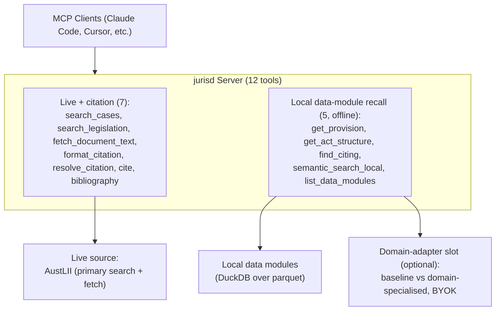

# jurisd Architecture Guide

**Version:** 1.0  
**Last Updated:** 2026-04-10

---

## Executive Summary

jurisd is a Model Context Protocol (MCP) server for Australian and New Zealand legal research.

**Key Features:**

- AustLII case + legislation search
- Digital PDF text extraction (pdf-parse)
- AGLC4 citation formatting
- Offline local-data-module recall (provision lookup, Act structure, citation graph, semantic search)

---

## System Architecture



The domain-adapter slot is **vendor-neutral**: the baseline adapter (pure local
cosine order, no key, always present) is selected unless a provider is both
configured and reachable, in which case a provider-interpolated label is reported.
The distinction is capability presence, never a paid/free tier.

---

## Components

### 1. MCP Server

**Tools** (12; live/citation operation variants selected via
`mode`/`op`/`action`/`by`):

Live + citation (7):
| Tool | Description |
|------|-------------|
| search_cases | AustLII case search |
| search_legislation | AustLII legislation search |
| fetch_document_text | Full-text retrieval (HTML/PDF) |
| format_citation | AGLC4 formatting: `mode: full\|short\|ibid\|subsequent\|pinpoint` |
| resolve_citation | Citation resolution: `mode: auto\|validate\|search` |
| cite | Citation cache write: `action: add\|refresh_source` |
| bibliography | Citation cache read: `op: get\|list\|export\|cited_by` |

Local data-module recall (5; offline, closed-world over installed modules):
| Tool | Description |
|------|-------------|
| get_provision | Deterministic provision lookup (no embedding, no ranking) |
| get_act_structure | Containment tree via `act_provision` edges |
| find_citing | Offline citator (cites/considers edges) |
| semantic_search_local | Local-embedding cosine recall over chunk vectors |
| list_data_modules | Introspect installed modules (metadata only) |

### 2. AustLII Service

- Searches AustLII SinoSearch CGI API
- Authority-based ranking (HCA > FCAFC > FCA > state courts)
- Rate limiting: 10 req/min

### 3. Document Fetcher

- HTML: Cheerio parse
- PDF: pdf-parse (digital text only)
- Extracts paragraphs for pinpoint citations

### 4. Citation Service

- AGLC4 formatting
- Validates against AustLII
- Generates pinpoint citations

### 5. Local Data Layer

- Installed parquet "data modules" under `~/.jurisd/modules/`, each a closed
  world validated against the vendored manifest schema (`src/data/manifest.ts`)
- Lazy per-module DuckDB attach over parquet (`@duckdb/node-api`, optional); the
  registry holds metadata only until first query
- Local query embedding (`@huggingface/transformers`, optional) for
  `semantic_search_local`; absence degrades visibly, never crashes
- Optional vendor-neutral domain-adapter slot refines the LOCAL top-k (rerank /
  extractive-QA); baseline cosine order is the floor
- Module acquisition is a CLI subcommand (`jurisd fetch-module`), not a tool:
  manifest is schema-validated and every file sha256-verified before an atomic
  temp-then-rename install

---

## Deployment

### Local Development

```bash
git clone https://github.com/russellbrenner/jurisd.git
cd jurisd
npm install
npm run dev
```

### Docker

```bash
docker build -t jurisd .
docker run --rm -it jurisd
```

### HTTP Transport

For remote deployment, set `MCP_TRANSPORT=http`:

```bash
MCP_TRANSPORT=http npm start
# Listens on port 3000
```

---

## Configuration

| Variable            | Default           | Description                                   |
| ------------------- | ----------------- | --------------------------------------------- |
| AUSTLII_SEARCH_BASE | AustLII URL       | Search endpoint                               |
| AUSTLII_TIMEOUT     | 60000             | Request timeout (ms)                          |
| MCP_TRANSPORT       | stdio             | stdio or http                                 |
| ISAACUS_API_KEY     | —                 | BYOK key for the optional domain-adapter slot |
| JURISD_MODULES_DIR  | ~/.jurisd/modules | Installed local data-module root              |

---

## Testing

```bash
npm test                        # All tests
npx vitest run src/test/unit/   # Unit only (fast, no network)
```

---

## Security

- **SSRF Protection:** URL allowlist (AustLII only)
- **Rate Limiting:** Token bucket per source
- **Secrets:** Never commit cookies or API keys

---

## See Also

- [README.md](../README.md) — Quick start, tool catalog
- [AGENT-GUIDE.md](./AGENT-GUIDE.md) — Agent usage guide
- [DOCKER.md](./DOCKER.md) — Docker deployment
- [ROADMAP.md](./ROADMAP.md) — Development history

---

**License:** MIT
